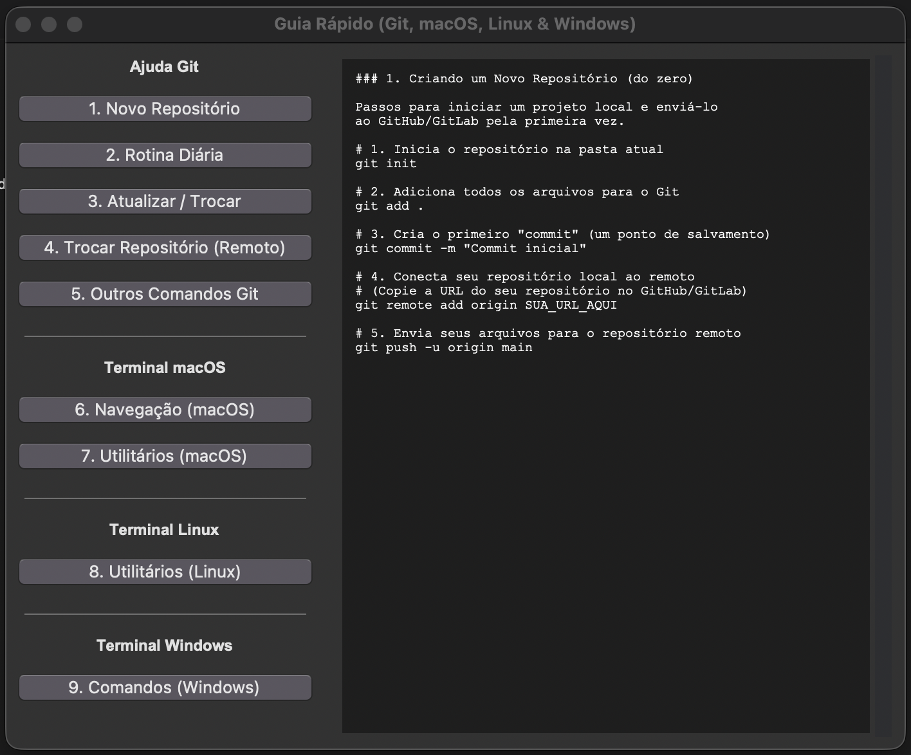

<h1 align="center">
   🚀 Git Helper - Guia Rápido de Comandos
</h1>

<p align="center">
  
</p>

---

<p align="center">
  
</p>

---

## 📖 Sobre o Projeto

Um script simples em Python (usando Tkinter) que cria uma janela flutuante **"sempre no topo"** para servir como um guia rápido e interativo de comandos do Git e do Terminal.

**Perfeito** para quem está aprendendo ou precisa de uma "cola" rápida sem sair da janela principal de trabalho.

---

## ✨ Funcionalidades

- 📌 **Sempre no Topo**: A janela flutua sobre seus outros aplicativos (como VS Code ou Terminal) para referência rápida
- 🎯 **Interface Simples**: Lista de botões à esquerda permite navegar rapidamente entre os tópicos
- 📚 **Guias de Ajuda**: Inclui guias para:
  - Rotinas comuns do Git (novo repo, rotina diária, trocar remotos)
  - Comandos úteis do Terminal para macOS (zsh/bash)
  - Comandos úteis do Terminal para Linux (bash/zsh)
  - Comandos úteis do Terminal para Windows (cmd)
- ⌨️ **Atalho de Terminal**: Pode ser iniciado de qualquer lugar com um comando simples (ex: `helpgit`)

---

## 📋 Pré-requisitos

Antes de começar, garanta que você tenha instalado:

**Python 3**

**Tkinter**: Biblioteca gráfica do Python
- **macOS/Windows**: Geralmente já vem instalado por padrão com o Python
- **Linux**: Pode ser necessário instalar:
  ```bash
  sudo apt-get install python3-tk
  ```

Você pode testar se o Tkinter está instalado rodando:
```bash
python3 -m tkinter
```
*(Uma pequena janela de teste deve aparecer)*

---

## 🛠 Instalação e Configuração

### 🍎 macOS (Terminal zsh ou bash)

#### 1. Salve o Arquivo
Salve o arquivo `git_helper.py` em um local permanente no seu computador.

**Exemplo de local**: `/Users/seu-usuario/scripts/git_helper.py`

#### 2. Crie o Atalho (Alias)
Abra o arquivo de configuração do seu shell (O padrão no macOS moderno é o `.zshrc`):

```bash
nano ~/.zshrc
```

Use as setas para ir até o final do arquivo e adicione a seguinte linha:

```bash
# Atalho para o Guia Rápido de Git
alias helpgit="python3 '/Users/seu-usuario/scripts/git_helper.py' > /dev/null 2>&1 &"
```

> **Nota 1**: As aspas simples (`'...'`) são essenciais se o seu caminho tiver espaços.  
> **Nota 2**: O `> /dev/null 2>&1 &` faz com que o script rode em segundo plano e libere seu terminal imediatamente.

#### 3. Recarregue o Terminal
Salve o arquivo no nano (`Control + O`, `Enter`) e saia (`Control + X`). Aplique as mudanças:

```bash
source ~/.zshrc
```

#### 4. Teste
Feche e reabra seu terminal. De qualquer pasta, digite `helpgit` e a janela deve aparecer! ✨

---

### 🐧 Linux (Terminal bash ou zsh)

#### 1. Salve o Arquivo
Salve o arquivo `git_helper.py` em um local permanente.

**Exemplo de local**: `/home/seu-usuario/scripts/git_helper.py`

#### 2. Crie o Atalho (Alias)
Abra o arquivo de configuração do seu shell (O mais comum no Linux é o `.bashrc`):

```bash
# Para o shell bash (padrão na maioria das distros)
nano ~/.bashrc

# Se você usa zsh
# nano ~/.zshrc
```

Use as setas para ir até o final do arquivo e adicione a seguinte linha:

```bash
# Atalho para o Guia Rápido de Git
alias helpgit="python3 '/home/seu-usuario/scripts/git_helper.py' > /dev/null 2>&1 &"
```

#### 3. Recarregue o Terminal
Salve o arquivo no nano e aplique as mudanças:

```bash
# Se você editou .bashrc
source ~/.bashrc
```

#### 4. Teste
Feche e reabra seu terminal. De qualquer pasta, digite `helpgit` e a janela deve aparecer! 🎉

---

### 🪟 Windows (cmd ou PowerShell)

#### 1. Salve o Arquivo
Salve o arquivo `git_helper.py` em um local permanente.

**Exemplo de local**: `C:\Users\SeuUsuario\scripts\git_helper.py`

#### 2. Crie o Atalho (.bat)
Na mesma pasta onde você salvou o script, crie um novo arquivo de texto e renomeie-o para `helpgit.bat`.

Clique com o botão direito em `helpgit.bat` e escolha "Editar". Cole o seguinte conteúdo:

```batch
@echo off
pythonw "C:\Users\SeuUsuario\scripts\git_helper.py"
```

> **Nota**: Usamos `pythonw.exe` (em vez de `python.exe`) porque ele executa o script Python sem abrir uma janela de console (terminal) preta ao fundo.

#### 3. Adicione ao PATH do Sistema
1. Pressione a tecla **Windows** e digite "Variáveis de ambiente"
2. Clique em "Editar as variáveis de ambiente do sistema"
3. Na janela que abrir, clique no botão "Variáveis de Ambiente..."
4. Na seção "Variáveis de usuário", encontre a variável chamada **Path** e clique em "Editar..."
5. Clique em "Novo"
6. Cole o caminho da sua pasta de scripts (ex: `C:\Users\SeuUsuario\scripts\`)
7. Clique "OK" em todas as janelas para salvar

#### 4. Teste
Feche e reabra completamente todas as janelas do seu terminal (cmd ou PowerShell). De qualquer pasta, digite `helpgit` e a janela deve aparecer! 🚀

---

## 🎯 Tecnologias Utilizadas

<p align="center">
  
</p>

---

## 📝 Licença

Este projeto está sob licença livre para uso pessoal e educacional.

---

<p align="center">
  Feito com ❤️ para a comunidade de desenvolvedores
</p>